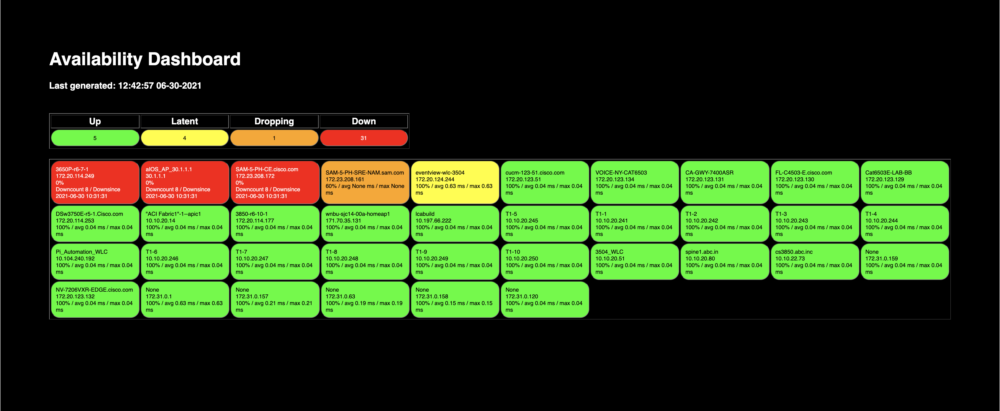

# DevNet Dashboards - Converged Availability Monitor

The DevNet Dashboards - Converged Availability Monitor (DD-CAM) project is part of a new set of automation offers called DevNet Dashboards.  These projects are based on leading practices developed in our Network Operations Center (NOC) for our CiscoLive conference events in the US and Europe.  We plan to release modules that can be used together to enhance network observability.

This specific project provides a multi-domain, converged availability dashboard that uses Element Management Systems (EMSs) and controllers as sources of truth for device inventory.  You will not have to run a network scanning tool or utility to feed inventory for DD-CAM.  The current modules that extract inventory for DD-CAM are:

1. Prime Infrastructure
2. DNA Center
3. ACI APIC controller

Each type of EMS/controller-specific source of truth has a Python script which reads its inventory and imports it into a MySQL database.  A separate Python script extracts the converged device list from the database and feeds it to an optimized ping utility, fping, from the opensource project at https://fping.org/  A simple dashboard is then generated and published into an Apache webserver for view on a browser.  This browser can be in a kiosk mode for a NOC or it can be easily viewed on a mobile device - phone or tablet.

The business driver for this was to bring multiple management tools' and controllers' inventory together into a converged availability dashboard without requiring yet another network discovery engine.  Each of these management tools already act as a source of truth for their own domain, so we will use their sophisticated discovery and inventory management processes to fulfill our needs.

## Technology Stack /  Architecture overview
Below is the overall architecture for the project.

<kbd></kbd>

Other things you might include:

## Status
v1.0 released to Automation Exchange
This is based on technology and processes used for over 7 years in the CiscoLive NOC.

## Screenshot / Output
<kbd></kbd>

## Use Case Description
This project solves Availability Monitoring issues when dealing with cross-domain management tools and controllers.  While plenty of other open-source projects exist to show availability dashboards, few address the basic first step, getting the network devices into inventory.  They leave that exercise to you.  This project extracts the inventory from several supplied sources of truth, such as Prime Infrastructure, DNA Center and the ACI APIC controller.  Multiple instances of each of these systems are allowed, for large environments.
One of the challenges this project addresses is how to ping monitor so many end-points.  We're using the fping (fast ping) project's utility to do optimized ping tests.
Since this project was intended to be modular in the importation of devices from the management tools and controllers, it can be extended to other systems like VMware vCenter (monitor VMs), NetApp ONTAP (monitor filers), Kubernetes, etc.  The options are many.  Check back as we add more sources in the future.

## Installation

Two options are provided: self-directed installation with requirements OR Docker.  Pick whichever suits your preference, security requirements and deployment capabilities.
When running as a self-directed installation with requirements, it is suggested to run this project in its own Linux Virtual Machine.  Development was done on CentOS Stream 8.3, but releases at or above the 7 train or other Linux variants should be fine.
Additionally, Apache and Python environments should be installed - CentOS may have provided one in your installation.  Our guidance is to keep the system-supplied version and install the latest Python and use virtual environments (venv) to maintain separation of environments from the core operating system.  Our development was done on Python v3.9.1, but anything above v3.7 should be sufficient.
 
### Local, Linux-specific Installations:
#### Step 1: Linux environment

Build a standard Linux VM with these initial characteristics [increase later if more performance is needed]
1 vCPU, 4 GB vRAM, 20 GB vHD
RedHat Enterprise Linux, CentOS and Ubuntu are fine.  Development was done on CentOS Stream 8.

#### Step 2: Python

Ensure you have at least a Python 3.7 or higher environment.  Virtual Environment (venv) support is suggested.

#### Step 3: Apache

Install Apache web server on Linux VM.
This [Apache installation instruction](https://www.tecmint.com/install-apache-with-virtual-host-on-centos-8/) is a good reference, if you need assistance.

#### Step 4: MySQL

Install MySQL database server on Linux VM.  Development was done on MySQL Community Edition 8.0.21.
This [MySQL installation guide]() is a good reference, if you need assistance.

#### Step 5: fping

Install the fping utility from [this enhanced fping source](https://github.com/bonkf/fping/tree/json-output).

    $ git clone --branch json-output https://github.com/bonkf/fping.git

#### Step 6: DD-CAM software

Download the DD-CAM project

    $ cd <project_directory>
    $ git clone https://github.com/<ORGNAME>/<REPONAME>.git

#### Step 7: MySQL Database user and table work

Note the SQL for creating tables and users for the project in the mysql-table-ddl.sql file.
Ensure you have a sound password selection for the database user.

### Docker Installations:
Ensure you have docker and docker-compose installed in your environment.  In the project's [docker](./docker/) directory is the [docker-compose.yaml](./docker/docker-compose.yaml) file which defines the environment's service requirements.  Essentially, Apache, Python and MySQL images are created.  Remember your first time running 'docker-compose up' will require some time to download images from standard repositories.
For the docker image we will create two container volumes, web-data and mysql-data, which maintain the dynamic content for the Apache server and the MySQL database.  They will persist data if 'docker-compose stop' or 'docker-compose down' is executed.  Ensure you monitor the host system's file storage.  Development was done with about 20G disk space and easily manages thousands of endpoint monitors.  

Access the Python container from the host server running docker, with 'docker exec -it dd-cam_python_1 bash'.  The project files are in /project/code.

## Configuration

An 'optionsconfig.yaml' file defines the Prime Infrastructure, DNA Center and ACI APIC controller IP addresses and authorized API user credentials.  The supplied optionsconfig.yaml file is currently pointing to DevNet Always-On Sandbox systems.  Please note, the devices extracted from those inventories are NOT generally reachable from the public Internet, so your dashboards will have a lot of RED until you reconfigure it to point to EMS/controllers that have access to your network devices.

Edit the [src/optionsconfig.yaml](./src/optionsconfig.yaml) file to suit your environment's inventory sources.  Multiple entries are allowed.  Comment out entries that are not currently used, preserving them for future options.  Enter each server's hostname/IP Address, authorized API username and password and any other parameters of interest.

## Usage

The first script getPrimeInfraDevices.py, performs device list extraction from Prime Infrastructure server(s) and imports them into the MySQL database, 'inventory' table.
The second script getDNACDevices.py, performs device list extraction from DNA Center server(s) and imports them into the MySQL database, 'inventory' table.
The third script getACIAPICDevices.py, performs device list extraction from ACI APIC controller(s) and imports them into the MySQL database, 'inventory' table.
The forth script PingandUpdateInventory.py, extracts the device list from the MySQL database and submits the list of devices to fping.  It also collects the results and updates the database.
The fifth script CreateAvailabilityDashboard.py, creates the dashboard from the MySQL database results.

Run the following Python scripts at least once manually or schedule in a crontab, as needed, based on your rate of network device change.  These scripts extract the network inventory and put them into the MySQL database.

    $ python getPrimeInfraDevices.py
    $ python getDNACDevices.py
    $ python getACIAPICDevices.py

Run the following Python scripts in a crontab, based on how often you'd like to update the dashboard - every 5 minutes, every minute, etc.

    $ python PingandUpdateInventory.py && python CreateAvailabilityDashboard.py

A standard crontab model could be:

    $ crontab -e
    #minute hour day_of_month month day_of_week command_to_run
    #Example of running every two minutes, every day
    */2 * * * * python PingandUpdateInventory.py  && python CreateAvailabilityDashboard.py

If you are extracting devices from your management tools/controllers that you can't or don't want to ping for availability, use the mysql shell to update the 'inventory' table.  Specifically, set the do_ping column value to 0 (zero) and it will not be pinged.

<kbd>

    $ mysql

    mysql> use devnet_dashboards;

    Reading table information for completion of table and column names
    You can turn off this feature to get a quicker startup with -A

    Database changed
    mysql> update inventory
      -> SET do_ping = 0
      -> WHERE mgmt_ip_address = '30.1.1.1';
    Query OK, 1 row affected (0.00 sec)
    Rows matched: 1  Changed: 1  Warnings: 0

    mysql>  
</kbd>

### DevNet Sandbox

The following DevNet Sandboxes are referenced in the [src/optionsconfig.yaml](./src/optionsconfig.yaml) file for sample sources of inventory:

[Prime Infrastructure v3.8 Always-on Sandbox](https://devnetsandbox.cisco.com/RM/Diagram/Index/446d800c-f6c1-45f0-bf88-b9d46baf9811?diagramType=Topology)

[DNA Center v1.3 Always-On Sandbox](https://devnetsandbox.cisco.com/RM/Diagram/Index/471eb739-323e-4805-b2a6-d0ec813dc8fc?diagramType=Topology)

[DNA Center v2.1 Always-On Sandbox](https://devnetsandbox.cisco.com/RM/Diagram/Index/c3c949dc-30af-498b-9d77-4f1c07d835f9?diagramType=Topology)

[ACI Simulator v4 Always-On Sandbox](https://devnetsandbox.cisco.com/RM/Diagram/Index/5a229a7c-95d5-4cfd-a651-5ee9bc1b30e2?diagramType=Topology)

## How to test the software

The scripts should generate entries in the mysql 'devnet_dashboards' database and 'inventory' & 'pingresults' tables.  Additionally an availability.html file should be dropped into the Apache web server's publication directory, usually /var/www/html.

## Known issues

None known at this time.

## Getting help

For additional help, look to the [DevNet Developer Support](https://developer.cisco.com/site/support/) team.  If major enhancements are requested, the [Cisco Customer Experience (CX) team](https://www.cisco.com/c/m/en_us/customer-experience/index.html) can be engaged for transactional assistance.  

If you have questions, concerns, bug reports, etc., please create an issue against this repository.

## Getting involved

 _How_ to contribute is found in the [CONTRIBUTING](./CONTRIBUTING.md) file.

## Credits and references

1. [fping project](https://fping.org)
2. [bonkf](https://github.com/bonkf/fping/tree/json-output)'s implementation of the JSON-output idea I proposed.

----

## Licensing info

See the [LICENSE](./LICENSE).

----
